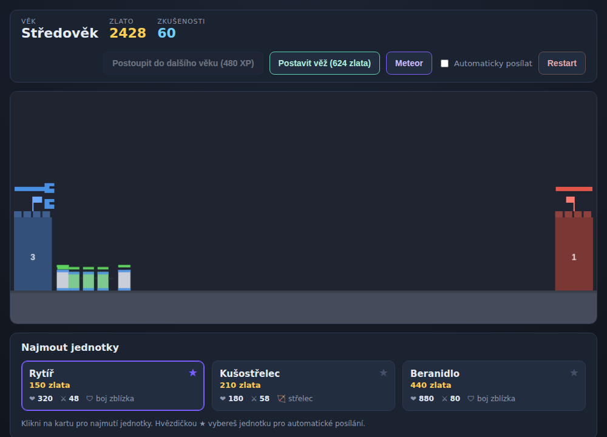

# Věky Války ⚔️

**Idle hra** ve stylu *Age of War* – běží přímo v prohlížeči, bez instalace.
Herní logika je oddělená do testovatelného jádra, takže funkčnost je **doložena
automatickými testy** (Node simulace + headless prohlížeč přes Playwright).



## Jak hrát

Otevři `index.html` v prohlížeči (stačí dvojklik) – víc není potřeba.

### Cíl

Znič nepřátelskou základnu (vpravo) dřív, než nepřítel zničí tu tvoji (vlevo).

### Mechaniky

- **Zlato** 💰 získáváš pasivně a za poražené nepřátele → najímání jednotek a stavbu věží.
- **Zkušenosti** ⭐ získáváš za poražené nepřátele → postup do dalšího věku.
- **Věky** 🏛️ – 5 věků (Pravěk → Antika → Středověk → Moderní doba → Budoucnost),
  každý s lepšími jednotkami a silnějšími věžemi.
- **Jednotky** – každý věk má tři druhy: 🛡 boj zblízka, 🏹 střelci, 🐘 tank.
- **Obranné věže** 🗼 – postav až 4 věže na základnu; samy střílí na nejbližšího nepřítele.
  Cena roste s počtem věží, síla podle věku v době stavby.
- **Meteor** ☄️ – speciální útok zraňující všechny nepřátele (cooldown 30 s).
- **Automatické posílání** 🤖 – idle režim, hra sama posílá vybranou jednotku
  (vyber ji hvězdičkou ★ na kartě).
- **Ukládání** 💾 – postup se průběžně ukládá do `localStorage`; tlačítkem **Restart**
  začneš novou hru.

## Struktura projektu

```
index.html            – stránka a HUD
css/style.css         – vzhled
js/engine.js          – herní JÁDRO (čistá logika, bez DOM; běží i v Node)
js/game.js            – prezentace (Canvas render, vstupy, ukládání)
tests/engine.test.mjs – testy jádra (node:test)
tests/browser.test.mjs– headless test celé hry (Playwright)
```

Klíčový princip: **`js/engine.js` neobsahuje žádnou závislost na DOM** a používá
deterministický seedovaný RNG. Díky tomu lze celou hru spustit a otestovat bez prohlížeče
(`Engine.createGame({ seed })` → reprodukovatelný průběh).

## Testy

```bash
# logika jádra (žádné závislosti)
npm test

# celá hra v reálném prohlížeči (jednorázová příprava)
npm install
npx playwright install chromium
npm run test:browser
```

## Tipy

- Zpočátku stav na levné jednotky a sbírej zkušenosti na první postup.
- Kombinuj boj zblízka (drží linii) se střelci (pálí zezadu) a postav pár věží na obranu.
- Nech zapnuté automatické posílání a soustřeď se na postup věky a meteor.
